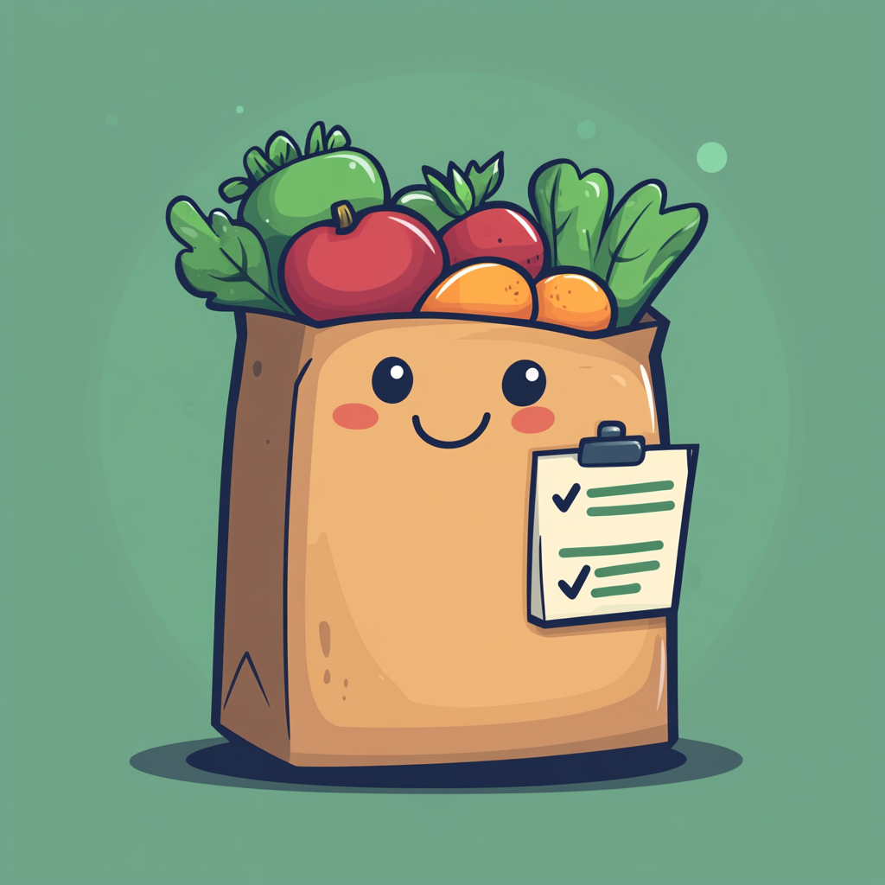
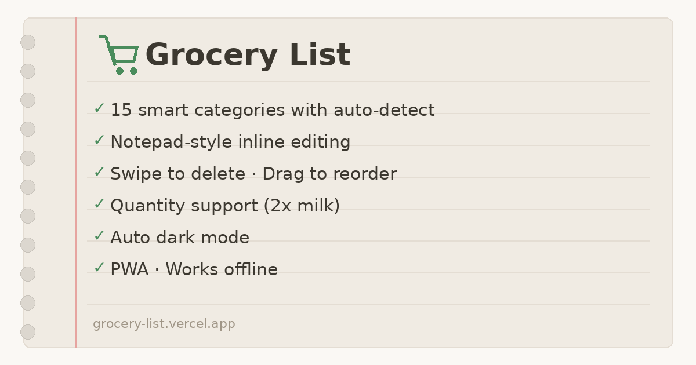

<p align="center">
  
</p>

<h1 align="center">Grocery List</h1>

<p align="center">A modern notepad-style grocery list PWA with smart features.</p>

<p align="center">
  
</p>

## Features

- **16 Smart Categories** — Auto-detects category as you type (1,300+ keywords covering American, Indian, and Asian groceries), plus a Misc catch-all for unrecognized items
- **Editable Categories** — Tap any item's category badge to reassign it via a picker
- **1,280+ Item Emojis** — Instant emoji preview and icons for every grocery item
- **39 Stores** — Costco, Walmart, Target, Trader Joe's, Whole Foods Market, Kroger, ALDI, H-E-B, Amazon Fresh, Publix, Gerbes, Sam's Club, Indian Bazaar, Pan Asia Supermarket, Patel Brothers, H Mart, 99 Ranch Market, Sprouts Farmers Market, ShopRite, Wegmans, Albertsons, Safeway, Stop & Shop, Giant Food, Giant Eagle, Food Lion, Meijer, WinCo, Market Basket, Hy-Vee, Ralph's, Harris Teeter, Piggly Wiggly, Save A Lot, Lidl, BJ's Wholesale, Stew Leonard's, Foodtown, Key Food
- **Store Tagging** — Assign items to stores with "@costco" or "@hmart", group by store view with favicons
- **Quantity Parsing** — Type "2x milk", "3 bananas", or "eggs x4"
- **Smart Sorting** — Checked items automatically move to the bottom
- **Swipe to Delete** — Swipe left on mobile to reveal delete zone
- **Undo Delete** — 3.5 second recovery toast with Undo button
- **Drag to Reorder** — Grip handle to rearrange items (desktop)
- **Handwritten Checkmark** — Animated SVG draw + strikethrough
- **Natural Scroll** — All items in a single scrollable list, no pagination
- **Collab Sharing** — Share sheet with three options: copy as text, share as link, or show QR code. Recipients can add to or replace their list.
- **Import via Link** — Shared lists encoded in URL hash (`#import=`), decoded on open with contextual onboarding for first-time users
- **QR Code Sharing** — Offline QR generation via `qrcode-generator` (no external API)
- **Dark Mode** — Auto-follows system preference via `prefers-color-scheme`
- **Handwritten Font** — Patrick Hand for a natural notepad feel
- **Paper Texture** — SVG noise overlay + corner curl + spiral binding
- **PWA** — Installable, works offline with service worker
- **SEO Optimized** — Open Graph, Twitter Cards, JSON-LD structured data

## Grocery Coverage

Comprehensive coverage across all categories with Indian and Asian specialty items:

| Category | Examples |
|----------|----------|
| **Produce** | Standard + lauki, karela, arbi, turai, amla, chikoo, sitaphal, edamame, bok choy, horseradish |
| **Dairy** | Standard + paneer, ghee, dahi, malai, khoya, shrikhand, lassi |
| **Meat & Seafood** | Standard + mutton, goat, keema + pomfret, rohu, surmai, bangda, hilsa |
| **Pantry & Grains** | Standard + basmati, poha, maggi, dal varieties + bajra, ragi, jowar, makhana, sattu |
| **Condiments & Spices** | Standard + garam masala, hing, kasuri methi, 15+ masala blends, achar, chutneys |
| **Snacks** | Standard + murukku, chakli, khakhra, gathiya, namak para, kurkure, parle-g |
| **Drinks** | Standard + rooh afza, jaljeera, thandai, badam milk, thumbs up, limca, rasna, tang |
| **Household** | Standard + agarbatti, harpic, phenyl + broom, mop, toilet cleaner |
| **Misc** | Catch-all for unrecognized items |

## Sharing & Collaboration

The app supports three sharing modes via a bottom sheet:

1. **Copy as Text** — Formats the list as plain text with store groupings, quantities, and checked status
2. **Share as Link** — Encodes up to 50 items as a base64 URL hash (`#import=...`), uses native share API or clipboard fallback
3. **QR Code** — Generates a scannable QR code containing the share link (offline, no external API)

When a recipient opens a shared link:
- **First-time users** see a contextual onboarding page showing the imported items with icons, quantities, and categories, with options to "Add items to my list" or "Replace my current list"
- **Returning users** see a compact import modal with the same add/replace options

## Why Choose Grocery List?

In a crowded space full of apps that require accounts, show ads, or force real-time sync, **Grocery List** stands out by staying **simple, private, and delightful**:

- No login or tracking — your data never leaves your device.
- Works 100% offline as a true PWA.
- Unique handwritten notepad aesthetic with animated checkmarks and paper texture.
- Deep support for Indian & Asian groceries (paneer, garam masala, murukku, etc.) alongside standard items.
- Elegant sharing: offline QR codes + URL import with smart onboarding.

Most alternatives (AnyList, Bring!, Cozi, Listonic, Out of Milk, OurGroceries) are excellent but typically require accounts and feel more corporate/utility-focused. Grocery List feels like a warm paper list that got smart superpowers.

---

## Comparison: Grocery List vs. Top Apps (2026)

| Aspect                | **Grocery List (PWA)**                                                                                                                | **AnyList**                                    | **Bring!**           | **Out of Milk**       | **Cozi**                       | **Listonic**                | **OurGroceries**      |
|-----------------------|--------------------------------------------------------------------------------------------------------------------------------------|------------------------------------------------|----------------------|-----------------------|---------------------------------|-----------------------------|-----------------------|
| Core Philosophy       | Minimalist notepad + smart features, zero bloat                                                                                      | Feature-rich, recipes optional                 | Colorful, icon-heavy  | Simple + pantry       | Full family organizer           | Simple, live sync           | Lightweight           |
| Account Required      | **No (fully local, zero tracking)**                                                                                                  | Yes                                            | Yes                  | Yes                   | Yes                            | Yes                        | Yes                  |
| Offline Support       | **Full (true PWA, works completely offline)**                                                                                        | Limited (sync needed)                          | Limited              | Partial               | Limited                        | Partial                    | Partial              |
| Auto-Categorization   | **Excellent (1,300+ keywords, editable, 16 categories, strong Indian/Asian coverage)**                                               | Good (auto-groups)                             | Good (icons)         | Basic                 | Basic                          | Good (auto-sorts)           | Basic                |
| Store Support         | **Strong (39 stores w/ @tagging, favicons; incl. Patel Bros, H Mart, Costco)**                                                       | Multi-store lists                              | Store-specific        | Basic                 | Basic                          | Limited                    | Limited              |
| Sharing               | **Best-in-class: Text, URL import (`#import=`), offline QR code, smart onboarding**                                                  | Real-time link/email                           | Social/link          | Link/sync             | Family accounts                | Live real-time sharing      | Link/sync            |
| UI/Feel               | **Delightful notepad, animated checkmark, paper texture**                                                                            | Clean & modern                                 | Bright, tiles        | Clean & simple        | Family-friendly                 | Simple & functional         | Functional           |
| Unique Delights       | Quantity parsing, swipe-to-delete w/ undo, drag reorder, 1,280+ emojis, natural single scroll, no pagination                         | Recipe import, delivery sync                   | Voice input, visuals | Pantry tracking       | Calendar/reminders              | Fast reuse of lists         | Very lightweight      |
| Privacy / Bloat       | **Excellent (no ads, no tracking, all local data)**                                                                                  | Good (premium upsells)                         | Ads in free          | Mostly free           | Ads in free                    | Free but tracks for sync    | Mostly free           |
| Cultural Coverage     | **Outstanding (paneer, garam masala, murukku, lauki, rooh afza, etc.)**                                                             | Standard Western                               | Standard             | Standard              | Standard                       | Standard                    | Standard             |
| Pricing               | **Completely free (MIT-friendly for forks)**                                                                                         | Free + premium                                 | Free + premium       | Free                  | Free + Gold                    | Free                       | Free                  |
| Mom-Test / Simplicity | **Very high (already validated with non-technical mom)**                                                                             | High                                           | High                 | High                  | High (for families)             | High                       | Medium-high           |

_Note: Comparison focuses on pure grocery list apps. Meal planners (Mealime, Paprika, etc.) are excluded to avoid recipe/import bloat, which Grocery List avoids by design._

---

**Key Takeaways:**
- Grocery List delivers a true zero-account, full offline PWA experience (no forced login for sharing).
- QR code and URL hash import sharing is still unmatched for quick family/roommate handoff — no installs or accounts needed.
- Cultural depth (Indian/Asian items and emojis) is excellent—most rivals don’t compete here.
- Delightful analog feel (paper texture, handwriting, undo toast) makes list-making emotionally pleasant, not just functional.

Other apps lead in special niches—AnyList for recipes/delivery, Bring! for visual/voice fun, Cozi for families—but none combine your exact mix of paper-like charm, smart keywords, privacy-first offline sharing, and multicultural support.

---

## Tech Stack

- React 18
- Vite 6
- vite-plugin-pwa (Workbox)
- qrcode-generator (offline QR code generation)
- CSS Variables for theming
- Zero external UI libraries

## Getting Started

```bash
# Install dependencies
npm install

# Run dev server
npm run dev

# Build for production
npm run build

# Preview production build
npm run preview
```

## Deploy to Vercel

```bash
# Install Vercel CLI
npm i -g vercel

# Deploy
vercel
```

Or connect your GitHub repo to [vercel.com](https://vercel.com) for automatic deployments.

## PWA Icons

All icons are included in `/public`:
- `favicon.ico` — Browser tab icon
- `favicon.svg` — SVG favicon for modern browsers
- `favicon-16x16.png` / `favicon-32x32.png` — PNG fallbacks
- `apple-touch-icon.png` (180x180) — iOS home screen
- `android-chrome-192x192.png` / `android-chrome-512x512.png` — Android PWA
- `logo.png` — App header logo
- `og-image.png` (1200x630) — Social sharing preview

## Project Structure

```
grocery-list/
├── public/
│   ├── robots.txt
│   └── sitemap.xml
├── src/
│   ├── components/
│   │   ├── CheckMark.jsx          # Animated check circle
│   │   ├── ContentEditable.jsx    # ContentEditable wrapper (replaces input for iOS)
│   │   ├── GroceryItem.jsx        # Item row + CategoryPicker for reassignment
│   │   ├── Header.jsx             # Title, item count, view toggle, share
│   │   ├── ImportModal.jsx        # Import prompt for returning users
│   │   ├── InputBar.jsx           # Text input, emoji preview, store autocomplete
│   │   ├── ListView.jsx           # Scrollable list with unchecked/checked sections
│   │   ├── Onboarding.jsx         # Welcome flow + contextual import onboarding
│   │   ├── QRModal.jsx            # QR code display modal
│   │   ├── ShareSheet.jsx         # Bottom sheet with share options
│   │   ├── StoreView.jsx          # Store-grouped view with headers
│   │   ├── SwipeRow.jsx           # Swipe-to-delete gesture wrapper
│   │   └── Toast.jsx              # Fixed-position toast with undo
│   ├── data/
│   │   ├── categories.js          # 16 category definitions + keyword lists
│   │   ├── itemEmojis.js          # Item emoji mappings + lookup function
│   │   └── stores.js              # 39 store definitions + favicon helper
│   ├── GroceryList.jsx            # Root component (state, handlers, composition)
│   ├── itemIcons.js               # Item icon detection
│   ├── notepadStyles.js           # Global CSS styles
│   ├── utils.js                   # detectCategory(), parseQty(), encodeList(), decodeList()
│   └── main.jsx                   # React entry point
├── index.html                     # HTML with SEO meta tags
├── package.json
├── vercel.json                    # Vercel deployment config
├── vite.config.js                 # Vite + PWA config
└── README.md
```

## License

MIT
